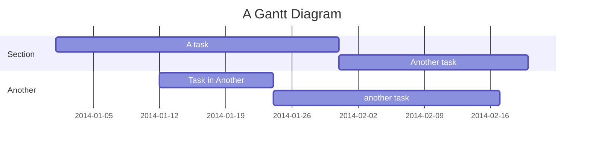
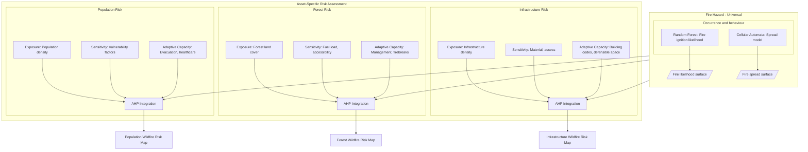

*Draft version*

---
## Introduction
### Introduction Outline
*Topics to explore on Introduction*
- [x] Fire
- [ ] Wildfire Impact
	- [x] Wildfire impact on: natural resources, human life, economy
	- [ ] Wildfire incidence in Paraguay, in the Chaco
- [ ] Wildfire mitigation efforts
	- [ ] What is done, when
	- [ ] Resources, mention modeling
- [ ] Wildfire risk modeling overview
	- [ ] MCDM modeling in Fire risk modeling
	- [ ] Aspects considered: hazard, exposure, sensitivity, adaptive capacity
	- [ ] Shortcomings of MCDM
	- [ ] Monte Carlo simulations and uncertainty
- [ ] Objectives
	- [ ] Develop a wildfire risk model adjusted for the Paraguayan Chaco
	- [ ] Run Monte Carlo simulations to asses uncertainties associated with AHP weights
	- [ ] Validate the model against FIRMS fire data
# Literature Review
## Fire

Fire is understood to be a natural and recurrent earth system process, contributing to the delineation of ecological boundaries, influencing geological cycles, and affecting atmospheric dynamics. These effects can be seen in ecoregions shaped on fire adaptation, fire effects on soil properties, and gasses released ([[Fire_in_Earth_System.pdf#page=2&selection=76,0,81,13&color=yellow|1]], [[Harrison_2021_Environ._Res._Lett._16_125008.pdf#page=3&selection=190,7,225,6&color=yellow|2]], [[Wildfire_as_a_hydrological_Shakesby.pdf#page=1&selection=10,0,14,59&color=yellow|10]]). Fire itself is considered to be a core ecological process across the planet ([[Fire_Ecology.pdf#page=60&selection=11,71,13,45&color=yellow|13]]).

Fire is a type of chemical reaction known as combustion. It liberates CO2, water in the form of steam, and stored energy in the form of light and heat ([[Introduction_to_Wildland_fire.pdf#page=20&selection=427,0,490,13&color=yellow|12]], [[Fire_Ecology.pdf#page=60&selection=15,8,25,24&color=yellow|13]]).

$$
(C_6H_12O_6)_n \rightarrow 6nCO_2 + 6nH_2O + energy
$$

This reaction is further decomposed in three subprocesses: preignition, ignition, and combustion. The first process, preignition, is an endothermic process where fuel temperature is raised to ignition temperatures. In the context of biomass, this temperature is around 350 C, usually involving the complete evaporation of water and terpen contents ([[Fire_Ecology.pdf#page=62&selection=0,0,27,43&color=yellow|13]]). Ignition is the transition between the endothermic and exothermic phases of a fire. At this point, the fuel temperature has been raised to the point where an external source of heat is not necessary to sustain combustion. Once this point is reached, the exothermic output of the combustion is enough to bring surrounding fuel to ignition temperatures ([[Introduction_to_Wildland_fire.pdf#page=21&selection=161,0,188,6&color=yellow|12]], [[Fire_Ecology.pdf#page=62&selection=45,69,48,40&color=yellow|13]]).

In its bare principales, fire takes three elements in order to occur: heat, oxygen, and fuel. As we move forward in space and time, these elements change and vary with scale. In order to visualize the three fire fundamental elements, a triangle is often used. To better exemplify the change of these elements with scale as we discuss wildfires, Cochrane and Ryan 2009 proposed the following figure:

*Figure 1. Fire triangles across different scales ([[Fire_Ecology.pdf#page=61&selection=38,0,56,15&color=yellow|13]])*.
## Wildfires

Although there are different approaches and definitions, wildfires are widely understood as "any unplanned and uncontrolled fire started in shrubs or forest" ([[The_Dilemma_of_Wildfire_Definition.pdf#page=2&selection=4,0,5,59&color=yellow|11]]). There is no distinction based on the source of ignition, so these fires can be naturally, intentionally, or accidentally set ([[Fire_Ecology.pdf#page=74&selection=32,0,34,61&color=yellow|13]]).

As discussed earlier, fire, and by consequence wildfires, have impacts that reverberate throughout the entire planet. Most recently, anthropogenic driven land use change and climate change have altered these dynamics through ecological fragmentation, increased ignition sources, and prolonged extreme weather events ([[Harrison_2021_Environ._Res._Lett._16_125008.pdf#page=8&selection=60,14,106,6&color=yellow|2]], [[05_Conceptual_Clarity_Fire_Science_Toy_opazo.pdf#page=2&selection=123,0,152,70&color=yellow|3]], [[03_Spatiotemporal_analysis_of_wildfires.pdf#page=2&selection=56,0,89,2&color=yellow|4]]). In this context, wildfire impacts have increased and are expected to become more frequent and destructive, with effects ranging from economic, ecological, and social as they affect infrastructure, regional economies, local production, and related health issues ([[Risk Analysis - 2023 - Kim - Analyzing indirect economic impacts of wildfire damages on regional economies.pdf#page=1&selection=60,33,94,40&color=yellow|5]], [[00_Wildfire_Risk_Modeling_Oliviera.pdf#page=1&selection=91,0,94,53&color=yellow|6]]).

The main drivers of fires can be divided in 4 groups: topography, vegetation, climatic variables, and human activity. These relationships are further subdivided by different attributes.

*Figure 2. Main drivers of wildfire, adapted from Yang et al. 2021 ([[01_Wildfire_Risk_w_MaxEnt_GIS_Xuhong.pdf#page=5&selection=156,0,158,34&color=yellow|14]])*.

These factors influence the dominant mechanisms of heat transfer in a fire event, which influences the rate of spread of the wildfire ([[Introduction_to_Wildland_fire.pdf#page=24&selection=6,0,114,14&color=yellow|12]]). Of particular importance are:

* Fuel arrangement
* Speed of the wind acting on the fire
- Slope
## Wildfire Impact

Wildfires have a myriad of impacts, that range from economic, environmental, and health issues, all related to one another. On its most direct way, wildfire threatens life, property, and local economies. Wildfires effects are also not localized, and can affect air quality up to thousand of miles away from the site of the fire event ([[Wildifre_impacts_in_USA.pdf#page=3&selection=26,0,39,21&color=yellow|15]]). From 2018 through 2020, only on the US, an average of 3.3 billion dollars were lost due to wildfires (16).

Most recently, anthropogenic driven land use change and climate change have altered these dynamics through ecological fragmentation, increased ignition sources, and prolonged extreme weather events ([[Harrison_2021_Environ._Res._Lett._16_125008.pdf#page=8&selection=60,14,106,6&color=yellow|2]], [[05_Conceptual_Clarity_Fire_Science_Toy_opazo.pdf#page=2&selection=123,0,152,70&color=yellow|3]], [[03_Spatiotemporal_analysis_of_wildfires.pdf#page=2&selection=56,0,89,2&color=yellow|4]]). In this context, wildfire impacts have increased and are expected to become more frequent and destructive, with effects ranging from economic, ecological, and social as they affect infrastructure, regional economies, local production, and related health issues ([[Risk Analysis - 2023 - Kim - Analyzing indirect economic impacts of wildfire damages on regional economies.pdf#page=1&selection=60,33,94,40&color=yellow|5]], [[00_Wildfire_Risk_Modeling_Oliviera.pdf#page=1&selection=91,0,94,53&color=yellow|6]]).

## Wildfire modeling
### Fire spread modeling

 
==**ADD MORE CONTEXT**==

==**ADD SOUTH AMERICAN CONTEXT**==

The Great American Chaco is an ecoregion with a large diversity of ecosystems: savannahs, shrublands, grasslands, wetlands, and the largest dry forest in the world. Its wide range of ecosystems and its location makes the Great American Chaco a key ecoregion, connecting the tropical Amazon forests and the Atlantic Forest on the east ([[04_Review_Wildfire_accross_the_chaco.pdf#page=2&selection=9,0,31,56&color=yellow|9]]) . This vast ecoregion is shared accros Argentina, Bolivia, Brazil, and Paraguay, with 25.4% of its surface being in Paraguay ([[00_WWF_Atlas.pdf#page=11&selection=6,0,34,6&color=yellow|8]]).

In Paraguay, wildfires affect more acutely the northern Chaco and Cerrado ecoregions, with estimates of over 7,000,000 hectares burned from 2011 to 2018. The wildfires are affected by seasonality, with the effects getting exacerbated by El Niño Southern Oscillation (ENSO), as well as human activity and climate change ([[09_Pierre_Florentin_ENSO_Paraguay_Wildfire.pdf#page=17&selection=124,42,131,76&color=yellow|7]]). 
# Study Area
# Data
# Timeline

# Methods

# Results and Discussion
# Conclusion
# References
1. [Fire in the Earth System](00_Literature/Foundational/Fire_in_Earth_System.pdf)
2. [Understanding and modelling wildfire regimes](00_Literature/Paraguayan Wildfires/17_Fires_in_the_Chaco.pdf)
3. [Conceptual Clarity in Fire Science](00_Literature/Phase 1/05_Conceptual_Clarity_Fire_Science_Toy_opazo.pdf)
4. [Spatiotemporal analysis of wildfires](00_Literature/Paraguayan Wildfires/1-s2.0-S0048969724069808-main.pdf)
5. [Analyzing indirect economic impacts of wildfire damages on regional economies](00_Literature/02_Wildfire_Impacts/Risk Analysis - 2023 - Kim - Analyzing indirect economic impacts of wildfire damages on regional economies.pdf)
6. [Wildfire risk modeling](00_Literature/04_Wildfire_Modeling/00_Wildfire_Risk_Modeling_Oliviera.pdf)
7. [Análisis de la ocurrencia de incendios forestales y su relación con el fenómeno climático de El Niño](00_Literature/03_Paraguayan_Wildfires/09_Pierre_Florentin_ENSO_Paraguay_Wildfire.pdf)
8. [WWF Paraguay - Page visited 2/4/2026](https://www.wwf.org.py/?354190)
9. [A review of wildfires effects across the Gran Chaco region](00_Literature/03_Paraguayan_Wildfires/04_Review_Wildfire_accross_the_chaco.pdf)
10. [Wildfire as a hydrological and geomorphological agent](00_Literature/02_Wildfire_Impacts/Wildfire_as_a_hydrological_Shakesby.pdf)
11. [The dilemma of wildfire definition](00_Literature/00_Foundational/The_Dilemma_of_Wildfire_Definition.pdf)
12. [Introduction to Wildland Fire](00_Literature/00_Foundational/Introduction_to_Wildland_fire.pdf)
13. [Fire and Fire Ecology](00_Literature/00_Foundational/Fire_Ecology.pdf)
14. [Wildfire Risk Assessment and Zoning with Maxent](00_Literature/04_Wildfire_Modeling/01_Wildfire_Risk_w_MaxEnt_GIS_Xuhong.pdf)
15. [Wildfires impacts in the US](00_Literature/02_Wildfire_Impacts/Wildifre_impacts_in_USA.pdf)
16. NOAA (Natl. Ocean. Atmos. Assoc.). 2024. Billion-dollar weather and climate disasters 2024. Natl. Cent. Environ. Inf., Natl. Ocean. Atmos. Assoc., Washington, DC. https://www.ncdc.noaa.gov/billions/
17. 