# Fire Probability Modeling Workflow: Point Training to Raster Prediction

## Complete Workflow Flowchart

```mermaid
flowchart TD
    Start([Start: Fire Probability Modeling]) --> DataPrep[Data Preparation Phase]
    
    DataPrep --> FirePoints[FIRMS Fire Points<br/>2000-2026<br/>MODIS + VIIRS]
    DataPrep --> Predictors[Predictor Layers in GEE<br/>- CHIRPS precipitation<br/>- ERA5 temperature/humidity<br/>- MODIS land cover<br/>- SRTM elevation<br/>- Distance to agriculture]
    
    FirePoints --> ExtractFire[Extract predictor values<br/>at fire point locations]
    Predictors --> ExtractFire
    
    ExtractFire --> BackgroundSample[Generate background points<br/>random non-fire locations<br/>match fire point count]
    BackgroundSample --> ExtractBackground[Extract predictor values<br/>at background point locations]
    
    ExtractBackground --> MergeData[Merge datasets:<br/>Fire points label=1<br/>Background points label=0]
    ExtractFire --> MergeData
    
    MergeData --> SplitData{Split Data Strategy}
    
    SplitData --> SplitTemporal[Temporal Split<br/>Train: 2000-2024<br/>Test: 2025-2026]
    SplitData --> SplitSpatial[Spatial Split<br/>Train: 70% area<br/>Test: 30% area]
    SplitData --> SplitRandom[Random Split<br/>Train: 80%<br/>Test: 20%]
    
    SplitTemporal --> TrainData[Training Point Dataset<br/>Columns: predictors + fire/no-fire label]
    SplitSpatial --> TrainData
    SplitRandom --> TrainData
    
    SplitTemporal --> TestData[Testing Point Dataset<br/>Columns: predictors + fire/no-fire label]
    SplitSpatial --> TestData
    SplitRandom --> TestData
    
    TrainData --> ModelChoice{Model Selection Phase}
    
    ModelChoice --> TrainRF[Train Random Forest<br/>in GEE or Python]
    ModelChoice --> TrainXGB[Train XGBoost<br/>in Python]
    ModelChoice --> TrainNN[Train Neural Network<br/>in Python<br/>optional]
    
    TrainRF --> ValidateRF[Validate RF on test points<br/>Calculate AUC, Kappa, Precision]
    TrainXGB --> ValidateXGB[Validate XGBoost on test points<br/>Calculate AUC, Kappa, Precision]
    TrainNN --> ValidateNN[Validate NN on test points<br/>Calculate AUC, Kappa, Precision]
    
    ValidateRF --> CompareModels{Compare Model Performance}
    ValidateXGB --> CompareModels
    ValidateNN --> CompareModels
    
    TestData --> ValidateRF
    TestData --> ValidateXGB
    TestData --> ValidateNN
    
    CompareModels --> SelectBest[Select Best Model<br/>Highest AUC/Kappa]
    
    SelectBest --> BestModel{Which model won?}
    
    BestModel -->|RF best| UseGEE[Use GEE RF for<br/>raster prediction<br/>FAST]
    BestModel -->|XGBoost/NN best| UsePython[Use Python for<br/>raster prediction<br/>SLOWER]
    
    UseGEE --> PredictGEE[GEE: Apply model to<br/>predictor image stack<br/>Every pixel gets prediction]
    UsePython --> ExportPredictors[Export predictor rasters<br/>from GEE to Python]
    
    ExportPredictors --> LoadArrays[Load rasters as arrays<br/>Stack into predictor array<br/>shape: rows×cols×n_predictors]
    LoadArrays --> ReshapePredict[Reshape to 2D<br/>n_pixels × n_predictors<br/>Feed to model]
    ReshapePredict --> PredictPython[Predict fire probability<br/>for all pixels]
    PredictPython --> ReshapeRaster[Reshape predictions<br/>back to rows×cols raster]
    
    PredictGEE --> FireProbRaster[Fire Probability Raster<br/>Value: 0-1 probability<br/>Resolution: 500m]
    ReshapeRaster --> FireProbRaster
    
    FireProbRaster --> DriverAttribution[Driver Attribution Phase]
    
    DriverAttribution --> SamplePixels[Extract stratified sample<br/>10k-50k pixels<br/>covering different probabilities,<br/>land uses, regions]
    
    SelectBest --> SamplePixels
    
    SamplePixels --> SHAPAnalysis[Calculate SHAP values<br/>in Python<br/>for sampled pixels]
    
    SHAPAnalysis --> SHAPGlobal[Global Feature Importance<br/>Which variables matter most?]
    SHAPAnalysis --> SHAPSpatial[Spatial SHAP Maps<br/>Where does each driver dominate?]
    SHAPAnalysis --> SHAPTemporal[Temporal SHAP Trends<br/>Are drivers changing over time?]
    
    SHAPGlobal --> DriverMaps[Create Driver Dominance Maps:<br/>- Climate-dominant zones<br/>- Land-use-dominant zones<br/>- Mixed zones]
    SHAPSpatial --> DriverMaps
    SHAPTemporal --> DriverMaps
    
    FireProbRaster --> VulnPhase[Vulnerability Assessment Phase]
    
    VulnPhase --> ForestVuln[Forest/Ecosystem Vulnerability<br/>- Intact vs degraded forest<br/>- Proximity to conversion zones<br/>- Ecosystem sensitivity]
    
    ForestVuln --> RiskCalc{Risk Calculation}
    
    FireProbRaster --> RiskCalc
    
    RiskCalc -->|Simple approach| SimpleRisk[Risk = Susceptibility × Vulnerability]
    RiskCalc -->|AHP approach| AHPRisk[Risk = AHP weighted overlay<br/>Susceptibility + Vulnerability]
    
    SimpleRisk --> FinalRisk[Final Fire Risk Map]
    AHPRisk --> FinalRisk
    
    DriverMaps --> Outputs[Final Outputs]
    FinalRisk --> Outputs
    
    Outputs --> MapOutputs[Maps:<br/>- Fire probability surface<br/>- Driver dominance zones<br/>- Ecosystem vulnerability<br/>- Integrated risk]
    
    Outputs --> StatOutputs[Statistics:<br/>- Model performance metrics<br/>- Feature importance rankings<br/>- Area under different risk classes<br/>- Driver contribution percentages]
    
    MapOutputs --> End([End: Thesis Results])
    StatOutputs --> End
    
    style Start fill:#e1f5e1
    style End fill:#ffe1e1
    style CompareModels fill:#fff4e1
    style SelectBest fill:#fff4e1
    style BestModel fill:#fff4e1
    style RiskCalc fill:#fff4e1
    style SplitData fill:#fff4e1
    style ModelChoice fill:#e1f0ff
    style FireProbRaster fill:#f0e1ff
    style FinalRisk fill:#f0e1ff
    style DriverMaps fill:#f0e1ff
```



## Key Points Explained

### 1. Point-Based Training & Validation

- **Training**: Model learns from point locations (fire + background points)
- **Validation**: Model tested on held-out point locations
- **Metrics calculated at point level**: AUC, Kappa, Precision, Recall
- Points DON'T need to be on a regular grid

### 2. Grid-Based Prediction

- **After validation passes**, apply model to every pixel in study area
- Each pixel = one prediction based on its predictor values
- Creates continuous probability surface

### 3. Validation Example (Temporal Split)

```
Training: 2000-2024
- Fire points: 45,000 FIRMS hotspots
- Background: 45,000 random non-fire points
- Total: 90,000 training points

Testing: 2025-2026
- Fire points: 5,000 FIRMS hotspots
- Background: 5,000 random non-fire points
- Total: 10,000 test points

Validation Process:
For each of the 10,000 test points:
  1. Extract predictor values at point location
  2. Model predicts fire probability
  3. Compare to actual label (fire=1 or no-fire=0)
  
Results: AUC=0.87, Kappa=0.72, Precision=0.81

Then: Apply to full grid (millions of pixels)
```

### 4. Why This Works

**Training/Testing** uses the actual spatial distribution of fires:

- Validates: "Can the model correctly identify where fires occurred vs. didn't occur?"
- Point-based metrics tell you if the model generalizes

**Prediction** creates the map:

- After validation confirms the model works, generate wall-to-wall probability
- Every pixel gets a probability based on its environmental conditions

### 5. SHAP Workflow

```
1. Train best model on all available data (2000-2026)
2. Predict fire probability for entire study area → RASTER
3. Extract sample of pixels (stratified by probability, land use, region)
4. For sampled pixels, calculate SHAP values in Python
5. Analyze SHAP patterns:
   - Global: Which features matter most?
   - Spatial: Map where climate vs. land use dominates
   - Temporal: Track driver changes over time
```

## Implementation Timeline

### Week 1-2: Data Preparation & Model Training

- Extract FIRMS points + predictors in GEE
- Generate background samples
- Export training data
- Train RF (and optionally XGBoost)

### Week 3: Validation & Model Selection

- Temporal validation (2025-2026 holdout)
- Spatial validation (regional holdout)
- Compare models, select best
- Document performance metrics

### Week 4: Raster Prediction & Driver Attribution

- Apply best model to full study area
- Generate fire probability raster
- Extract pixel sample
- Calculate SHAP values
- Create driver dominance maps

### Week 5: Risk Integration

- Assess forest vulnerability
- Calculate integrated risk
- Generate final maps
- Compile statistics

### Week 6: Results & Writing

- Finalize all outputs
- Write results section
- Create figures/tables
- Integrate into thesis