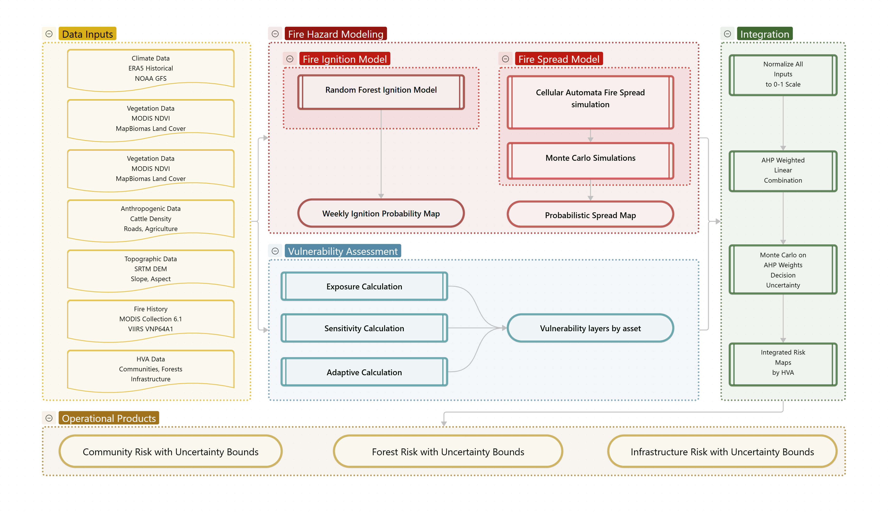

# Paraguayan Chaco Fire Risk
_Author: Paulo Medina_

## Flowchart

## Overview
**Topic and Problem Statement**: Fires are a natural and recurrent earth system process, with wide impacts in different aspects of the earth's ecological, atmospherical, and geological composition (Bowman et al. 2009). Although these natural occurrences are understood, changes in land cover driven by the expansion of the agricultural and livestock ranching frontier, as well as climate change, has altered these fire regimes, resulting in threatened biodiversity, ecosystemic services, and rural communities (Shlisky et. al 2009).

Within this global context, Paraguay is at the forefront of an accelerated deforestation and is one of the hotspots for fires in South America, even surpassing Brasil in the period within 1999-2015, with the vast majority of the fires concentrating in the Paraguayan Chaco region (NASA 2025). Despite this, a knowledge gap remains in fire impacts and vulnerabilities, particularly in Paraguayan Chaco, with most of the research focused on the neighboring countries (Vidal-Riveros et al. 2024).

Fires in the Paraguayan Chaco threaten biodiversity, the remaining unaltered protected areas, indigenous communities, and infrastructure. The fragmented pattern of the Paraguayan Chaco creates a greater exposure of forest edges, making the forests less resilient and more fire prone (Armenteras et al. 2013). In the sparsely populated Paraguayan Chaco, fires affect communities through respiratory illnesses, disruption in state services and general threats to livelihoods (Castilla 2024, Jasser 2021).

Research in the Paraguayan Chaco has mostly focused on identifying fire regimes, spatio-temporal patterns, and climatic interactions, with little literature identifying vulnerable assets throughout the region. This projects aims to address that gap by deploying a multi-decision criteria model integrating proven machine learning methodologies for predicting fire ignition probability and asset based vulnerability into a Analytical Hierarchy Process (AHP) model. The high value assets (HVA) considered in this projects are:

- Communities
- Forests
- Infrastructure

**Objectives**: The main goal of the project is to provide a model that can predict fire risk and identify the vulnerable high value assets at risk in the region with a spatial scale of 500 meters and weekly temporal resolution. The goal will be accomplished through these objectives:

- Produce a fire ignition risk model utilizing Random Forest to predict ignition likelihood for the following 7 days.
- Generate a spread likelihood probability layer running a fire spread model with a set number of Monte Carlo iterations for the following 7 days.
- Develop high value asset based layers for sensitivity, exposure, and adaptive capacity
- Integrate all outputs into the AHP model with uncertainty quantification.

**Data:** The models will rely on different data sources, including data from NASA, NOAA, the Paraguayan Statistical Institute, the Paraguayan National Electric Administration, MapBiomas, among others:

- **Fire Data (FIRMS):** Active fire hotspots from MODIS and VIIRS sensors (NASA) will serve as the dependent variable for the Random Forest model, providing historical fire occurrence locations with 375m and 1km spatial resolution.
- **Climatic Data:** 
  - *For model training (historical):* Temperature, precipitation, relative humidity, and wind speed/direction from ERA5 reanalysis (Copernicus Climate Data Store, 2015-2024) at 0.25° spatial resolution and hourly temporal resolution. Additionally, drought indices (SPEI, SPI) from TerraClimate (monthly, 4km resolution).
  - *For operational weekly predictions:* NOAA Global Forecast System (GFS) weather forecasts (temperature, precipitation, humidity, wind) at 0.25° resolution with 3-hourly output extending 16 days, enabling weekly fire risk predictions. The trained Random Forest model will ingest current GFS forecasts to generate weekly updated risk maps.
- **Vegetation Data:** MODIS NDVI (MOD13Q1, 250m, 16-day composite) to capture vegetation greenness and fuel moisture proxy; MapBiomas Chaco land cover classification (30m, annual) for fuel type mapping; and vegetation continuous fields (VCF) for tree cover percentage.
- **Anthropogenic Data:** Road networks and settlement locations from OpenStreetMap; agricultural expansion data from MapBiomas Chaco annual deforestation maps (1985-2023); cattle ranch locations from Paraguayan Ministry of Agriculture.
- **Topographic Data:** SRTM Digital Elevation Model (30m) for slope, aspect, and elevation variables affecting fire behavior and spread.
- **Infrastructure (HVA):** Power transmission lines from Administración Nacional de Electricidad (ANDE); road networks from OpenStreetMap; communication towers from national registry.
- **Community Data (HVA):** Settlement locations and population density from Instituto Nacional de Estadística (INE) census data; indigenous territory boundaries from Instituto Paraguayo del Indígena (INDI); health facility locations.
- **Forest Data (HVA):** Protected area boundaries from World Database on Protected Areas (WDPA); intact forest landscapes from Global Forest Watch; priority biodiversity areas from Key Biodiversity Areas database.

**Vulnerability Framework by High Value Asset:**

| HVA                | Exposure                                                               | Sensitivity                                                                                        | Adaptive Capacity                                                                                 |
| ------------------ | ---------------------------------------------------------------------- | -------------------------------------------------------------------------------------------------- | ------------------------------------------------------------------------------------------------- |
| **Communities**    | Proximity to predicted fire ignition and spread zones                  | Population density; presence of indigenous territories; infrastructure dependency                  | Distance to health facilities and emergency services; road network accessibility; education level |
| **Forests**        | Forest edge density; proximity to agricultural frontiers and roads     | Biodiversity value (endemic species, threatened habitats); protection status; forest fragmentation | Fire history and recovery patterns; forest connectivity                                           |
| **Infrastructure** | Proximity to predicted fire zones; spatial exposure of critical assets | Service criticality (power, communications); population served                                     | Road network accessibility                                                                        |

**Methods (Overview)**: 

*Fire ignition:*
The Random Forest model will be trained with hotspot data from FIRMS as the dependent variable, and climatic, anthropogenic, and vegetation data as explanatory variables. The dataset will be split 70% for training and 30% for validation. Weekly predictions will use NOAA GFS forecast data as input to generate ignition probability maps for the following 7 days.

*Fire spread:*
The FARSITE model will be run on the Paraguayan Chaco with fuel data prepared for the region. A set of 100 Monte Carlo simulations will be run to capture fire behavior uncertainty (wind variability, fuel moisture fluctuations), producing a probabilistic fire spread map layer.

*Exposure, Sensitivity, and Adaptive Capacity:*
The three vulnerability components will be calculated for each HVA based on the framework outlined above. All input layers will be normalized to a 0-1 scale using min-max normalization before integration.

*Fire risk and vulnerability:*
All normalized inputs will be combined using AHP weighted linear combination. AHP weights will be determined through sensitivity analysis testing multiple weighting schemes informed by fire ecology literature. Monte Carlo analysis will be conducted on the AHP weights themselves to quantify decision uncertainty and assess result robustness across different weighting assumptions. Final outputs will include both point estimates and uncertainty bounds for fire risk to each HVA category.

**Expected Outcomes:**

- Weekly fire risk maps at 500m resolution showing ignition probability, spread likelihood, and integrated risk for the Paraguayan Chaco
- HVA-specific vulnerability assessments identifying communities, forests, and infrastructure at highest risk
- Probabilistic risk estimates with uncertainty bounds from Monte Carlo analysis on fire spread and AHP weights
- Model validation metrics (AUC-ROC, skill scores, confusion matrices) demonstrating predictive performance
- Spatial database of vulnerable assets that can inform fire prevention strategies and emergency response prioritization
